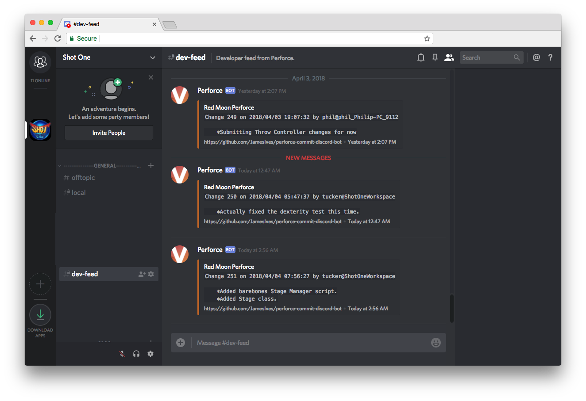

# Perforce Commit Logger Discord Bot 🗒️
With this bot you're able to keep track of commits made to a [Perforce version control](https://www.perforce.com/) server within a [Discord](https://discordapp.com/) channel. 

## Installation Steps 💽

1. Within your Discord server go to the settings for the channel you'd like the commit logs to be posted to and copy the webhook URL.
2. Save the webhook URL as an environment variable called `DISCORD_WEBHOOK_URL`. 
3. The service requires access to the `p4 changes` command, your bot should be installed somewhere where it can automatically perform this command. You can initialize the service by running `$ python app.py`.

## How It Works :clapper: 

Every thirty seconds the bot runs a Perforce command in the terminal that checks for the most recent changes. If it finds one it stores it in memory, if the change it finds is the same as the one it gathered previously then it discards it. You'll need to provide the bot with access to your servers Perforce command line. One way of doing this is running the Python application on the server which hosts your Perforce server. If you can type `p4 changes` yourself then the bot will be able to do its thing.

## Configuration 📁

The installation will require you to enter a number of settings as environment variables. Below you'll find an explanation of each.

| Key  | Value Information | Required |
| ------------- | ------------- | ------------- |
| `DISCORD_WEBHOOK_URL`  | The [Webhook URL](https://support.discordapp.com/hc/en-us/articles/228383668-Intro-to-Webhooks) for the Discord channel you'd like the bot to post its messages to. | **Yes** |

